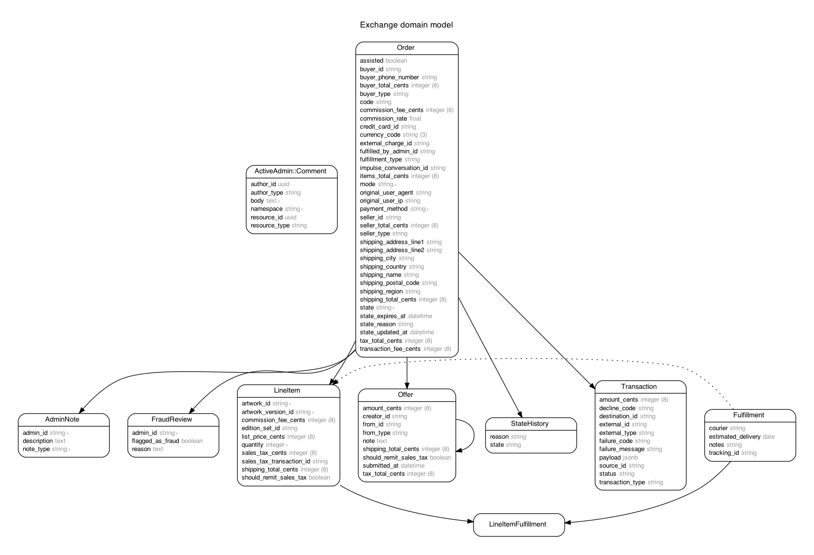

# Domain Model

The Entity-Relationship Diagram is generated by [Rails-ERD][rails_erd] gem and can be re-generated with
`bundle exec erd` (requiring Graphviz). See the documentation of the gem for more details.

[rails_erd]: https://github.com/voormedia/rails-erd
